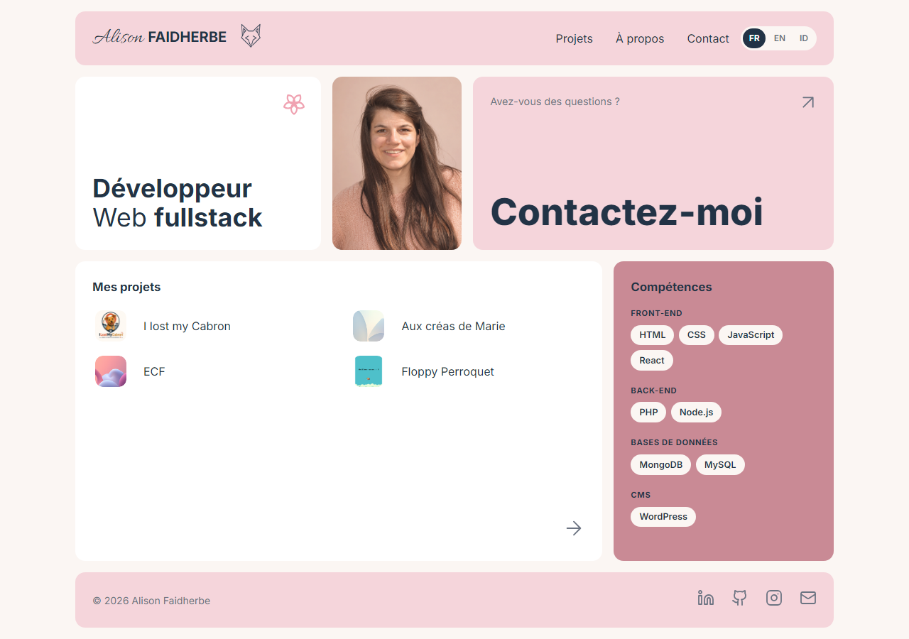
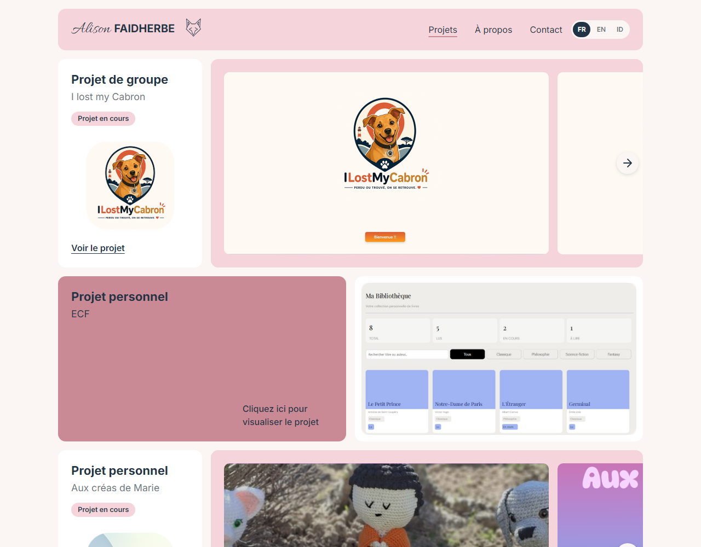
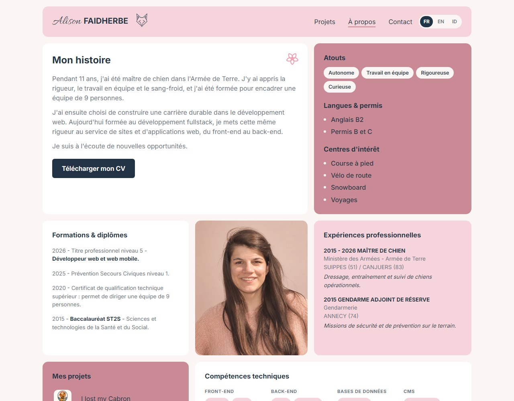
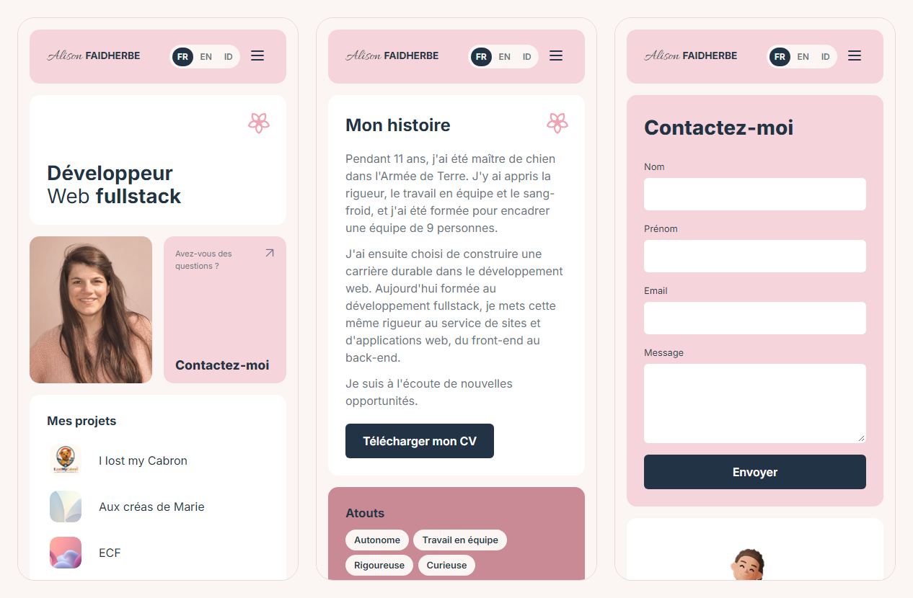

# Portfolio · Alison Faidherbe

**🔗 [alliiissonnee.github.io](https://alliiissonnee.github.io/)**

Mon portfolio de développeur web fullstack junior : mon parcours, mes projets et un formulaire pour me contacter.

## Le site

- **Accueil** : présentation, aperçu des projets et des compétences
- **Projets** : mes projets avec galeries de captures et liens vers le code
- **À propos** : mon parcours, de maître de chien dans l'Armée de Terre au développement web, et mon CV à télécharger
- **Contact** : formulaire envoyé via [Formspree](https://formspree.io)

Le site est disponible en **français, anglais et indonésien**. La langue suit celle du navigateur, et le CV téléchargé est dans la langue choisie.

## Aperçu

| Accueil | Projets | À propos |
| --- | --- | --- |
|  |  |  |

<details>
<summary>Voir le site sur mobile</summary>



</details>

## Technologies

- HTML5 et CSS3 (Grid, Flexbox, media queries), sans framework
- JavaScript natif : traduction FR / EN / ID, mode sombre, menu burger, galeries avec flèches
- Maquette conçue sur Figma

## Points soignés

- **Responsive** : ordinateur, tablette et téléphone
- **Mode sombre** : automatique selon l'appareil, avec un bouton pour choisir
- **Accessibilité** : textes alternatifs, navigation au clavier, libellés pour les lecteurs d'écran, respect du réglage « réduire les animations »
- **Sécurité** : Content Security Policy, liens externes protégés, champ anti-spam sur le formulaire

## Structure

```
├── index.html          Accueil
├── projets.html        Projets
├── a-propos.html       À propos
├── contact.html        Contact
├── css/style.css
├── js/
│   ├── main.js         Traduction, menu, galeries
│   └── traductions.js  Textes en anglais et en indonésien
├── cv/                 Sources HTML des CV (FR, EN, ID) qui servent à générer les PDF
└── assets/             Images et CV en PDF
```

## Lancer le site en local

Aucune installation n'est nécessaire : ouvrez `index.html` dans un navigateur.

## Contact

- [LinkedIn](https://www.linkedin.com/in/alliiissonnee)
- [GitHub](https://github.com/Alliiissonnee)
